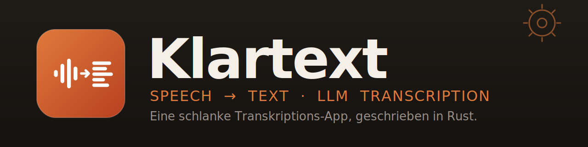

<p align="center">
  
</p>

<h1 align="center">Klartext</h1>

<p align="center">
  <strong>Local Speech-to-Text Transcription</strong><br>
  A desktop app for fast, private audio transcription with AI-powered summarization.<br>
  <sub>Built with <a href="https://kiro.dev">Kiro</a></sub>
</p>

---

## Table of Contents

- [Features](#features)
- [Quick Start](#quick-start)
- [Model Download](#model-download)
- [Usage](#usage)
- [Summarization](#summarization-optional)
- [Configuration](#configuration)
- [Architecture](#architecture)
- [Development](#development)
- [Tests](#tests)
- [Roadmap](#roadmap)
- [Built with Kiro](#built-with-kiro)
- [License](#license)

## Features

| Feature | Description |
|---------|-------------|
| 🔒 Fully local | All processing on your machine — no cloud, no data leaves your computer |
| ⚡ Fast transcription | NVIDIA Parakeet TDT model via ONNX Runtime |
| 🎮 GPU acceleration | DirectML — works with any GPU (NVIDIA, AMD, Intel); auto-fallback to CPU |
| 📂 Drag & drop | Drop audio files directly onto the window |
| 📋 File queue | Process multiple files sequentially |
| 🤖 AI summarization | Generate summaries or meeting protocols via local Ollama LLM |
| 💾 Export | Save transcriptions as TXT or Markdown |
| 🎵 Long files | Automatic 4-minute chunking for files of any length |
| 🎧 Audio formats | MP3 and WAV via symphonia (pure Rust decoding) |
| ⚙️ Custom prompts | Editable `prompts.toml` for summarization templates |

> **Note:** The application GUI is in German. Documentation is in English.

## Quick Start

### Prerequisites

- Windows 10/11 (Linux/macOS possible but untested)
- [Rust toolchain](https://rustup.rs/)
- [Ollama](https://ollama.ai/) (optional, for AI summarization)

### Installation

```bash
git clone https://github.com/achimbarczok/klartext.git
cd klartext
cargo build --release
```

The compiled binary will be at `target/release/klartext-rust.exe`.

## Model Download

The Parakeet TDT model (int8 quantized, ~670 MB total) is required for transcription.

### PowerShell (Windows)

```powershell
mkdir models\tdt
Invoke-WebRequest -Uri "https://huggingface.co/altunenes/parakeet-rs/resolve/main/tdt/encoder-model.int8.onnx" -OutFile "models\tdt\encoder-model.onnx"
Invoke-WebRequest -Uri "https://huggingface.co/altunenes/parakeet-rs/resolve/main/tdt/decoder_joint-model.int8.onnx" -OutFile "models\tdt\decoder_joint-model.onnx"
Invoke-WebRequest -Uri "https://huggingface.co/altunenes/parakeet-rs/resolve/main/tdt/vocab.txt" -OutFile "models\tdt\vocab.txt"
```

### Bash (Linux/macOS)

```bash
mkdir -p models/tdt
curl -L "https://huggingface.co/altunenes/parakeet-rs/resolve/main/tdt/encoder-model.int8.onnx" -o models/tdt/encoder-model.onnx
curl -L "https://huggingface.co/altunenes/parakeet-rs/resolve/main/tdt/decoder_joint-model.int8.onnx" -o models/tdt/decoder_joint-model.onnx
curl -L "https://huggingface.co/altunenes/parakeet-rs/resolve/main/tdt/vocab.txt" -o models/tdt/vocab.txt
```

## Usage

```powershell
$env:KLARTEXT_MODEL_PATH = "models\tdt"
cargo run --release
```

1. The model loads on startup (progress indicator shown)
2. Drag an audio file onto the drop zone, or click the file picker button
3. Transcription runs with a progress bar and time estimate
4. Copy the result, or export as TXT/Markdown
5. Optionally summarize the transcript using Ollama

## Summarization (Optional)

AI summarization requires [Ollama](https://ollama.ai/) running locally:

```bash
ollama pull gemma4:e4b
ollama serve
```

After transcription, select a mode and click "Zusammenfassen":

| Mode | Output |
|------|--------|
| Zusammenfassung | Title + two paragraphs summarizing the content |
| Protokoll mit Todos | Structured meeting protocol with a "Wer / Was / Bis wann" todo table |
| Eigener Prompt | Your own instructions |

### Custom Prompts

Edit `prompts.toml` to customize summarization behavior (no rebuild needed, just restart):

```toml
[summary]
prompt = "Your custom summary prompt here..."

[protocol]
prompt = "Your custom protocol prompt here..."
```

## Configuration

| Variable | Default | Description |
|----------|---------|-------------|
| `KLARTEXT_MODEL_PATH` | `./models/tdt` | Path to the Parakeet TDT model directory |
| `OLLAMA_URL` | `http://localhost:11434` | Ollama API endpoint |
| `OLLAMA_MODEL` | `gemma4:e4b` | LLM model for summarization |
| `KLARTEXT_PROMPTS_FILE` | `./prompts.toml` | Path to custom prompts file |
| `RUST_LOG` | `info` | Log level (trace, debug, info, warn, error) |

## Architecture

| Component | Technology |
|-----------|-----------|
| Speech-to-text | parakeet-rs (NVIDIA Parakeet TDT via ONNX Runtime) |
| GPU acceleration | DirectML execution provider (any GPU, CPU fallback) |
| Audio decoding | symphonia (pure Rust, MP3 + WAV) |
| GUI | egui / eframe |
| Summarization | Ollama API (ureq HTTP client) |
| Error handling | thiserror + anyhow |
| Logging | tracing + tracing-subscriber |
| Testing | proptest (property-based) + integration tests |

### Project Structure

```
├── src/
│   ├── main.rs              # Entry point, window setup
│   ├── gui/mod.rs           # egui GUI (German)
│   ├── core/
│   │   ├── engine.rs        # Parakeet TDT transcription + chunking
│   │   ├── converter.rs     # Audio format conversion (symphonia)
│   │   ├── validator.rs     # File validation (extension + header)
│   │   └── exporter.rs      # TXT/Markdown export
│   ├── worker.rs            # Background transcription thread
│   ├── summarizer.rs        # Ollama API integration
│   ├── queue.rs             # File queue management
│   ├── models.rs            # Data structures
│   └── errors.rs            # Error types (thiserror)
├── tests/
│   ├── property/            # Property-based tests (proptest)
│   └── integration/         # Integration tests
├── assets/                  # App icon and banner
├── models/                  # Model files (git-ignored)
├── prompts.toml             # Customizable summarization prompts
├── Cargo.toml
└── README.md
```

## Development

```bash
cargo build              # Debug build
cargo build --release    # Optimized build
cargo run                # Run (debug)
cargo clippy             # Lint
```

## Tests

75 tests including 20 property-based tests validating correctness properties.

```bash
cargo test
```

```
test result: ok. 49 passed; 0 failed    (unit tests)
test result: ok. 6 passed; 0 failed     (integration tests)
test result: ok. 20 passed; 0 failed    (property-based tests)
```

Property-based tests verify:
- File extension validation correctness
- Audio header detection
- Error message content
- TXT export round-trip
- Markdown metadata round-trip
- Queue filtering invariants

## Roadmap

- [ ] Speaker diarization (who said what)
- [ ] Streaming transcription (real-time)
- [ ] Multilingual model (v3 with 25 languages)
- [ ] Configurable chunk size
- [ ] Markdown rendering in summary view
- [ ] Linux/macOS builds and testing

## Built with Kiro

This project was developed using [Kiro](https://kiro.dev), an AI-powered IDE. Development followed the **Spec-Driven Development** methodology:

1. Requirements as user stories with acceptance criteria
2. Technical design with correctness properties
3. Implementation plan with referenced requirements
4. Property-based tests (proptest) for verification

Spec documents are in `.kiro/specs/`.

## License

[MIT](LICENSE)
